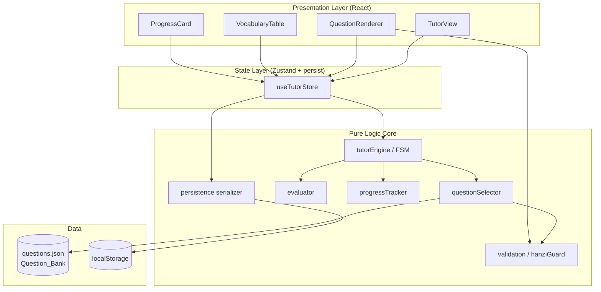
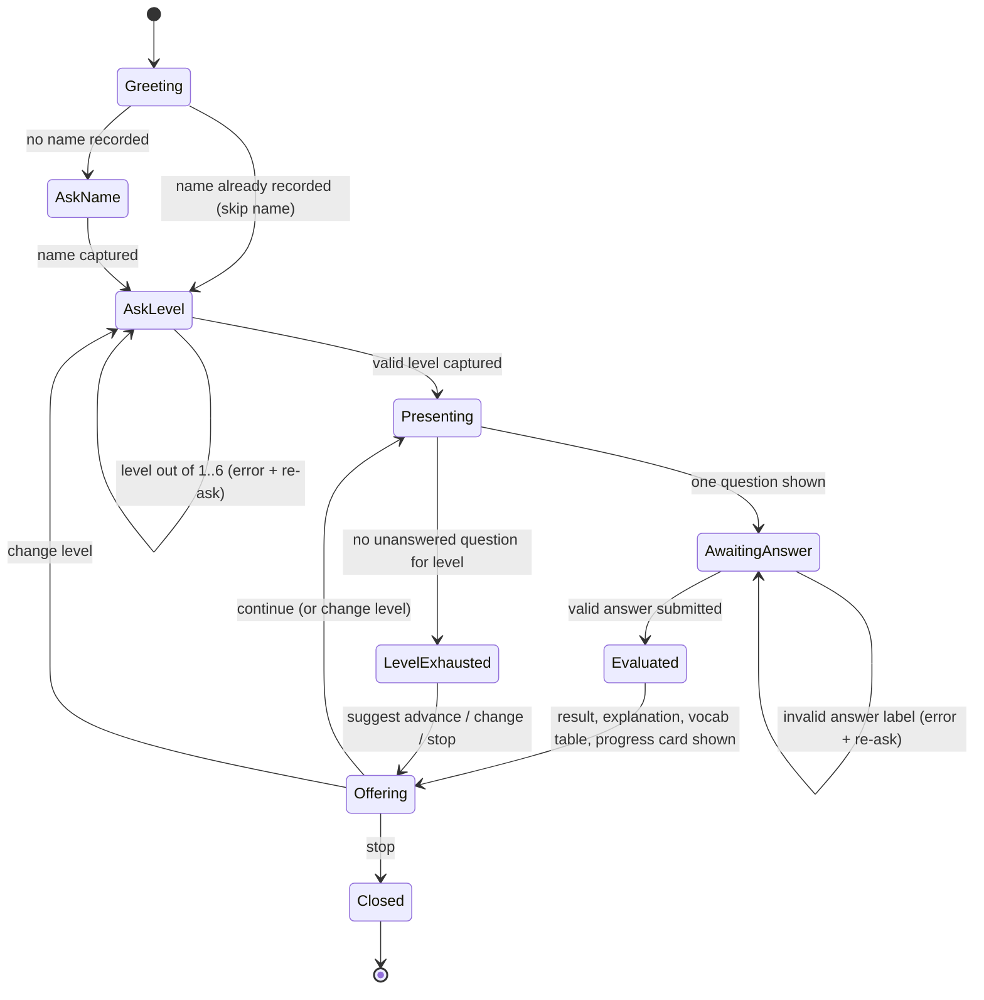

# Design Document

## Overview

HSK Master AI is a conversational Mandarin tutor embedded in the existing `china-hsk` React/TypeScript application. It onboards a learner, presents authentic HSK practice questions one at a time across Levels 1–6, evaluates answers, teaches vocabulary, and tracks per-session progress with client-side persistence.

The single most important product constraint shapes the entire design: **every question body, reading text, and answer choice (A/B/C/D) is rendered 100% in Hanzi** — no Pinyin, Indonesian, or English appears in the question surface. Pinyin and Indonesian meanings appear **only** in the supporting Hanzi Vocabulary Table that is shown *after* a question is answered. This separation is enforced both in the data model (distinct fields for question-surface text vs. supporting material) and at render time (a validation guard that strips/rejects non-Hanzi in the question surface).

The feature is organized around a deterministic, testable core of pure functions (selection, evaluation, progress math, validation, persistence serialization) wrapped by a thin React presentation layer and a Zustand store. This mirrors the project's existing pattern (`src/store/useGameStore.ts` already uses Zustand with the `persist` middleware), keeping the new tutor consistent with the codebase.

### Key Design Decisions

| Decision | Rationale |
|---|---|
| Separate the tutor into pure logic modules (`tutorEngine`, `evaluator`, `progress`, `selector`, `validation`) + thin React/Zustand layer | Makes the correctness-critical logic (evaluation, accuracy math, no-repeat selection, Hanzi enforcement) unit- and property-testable without rendering. |
| Introduce a **new** HSK question schema rather than reuse the existing Pinyin-drill `questions.json` shape | The existing file (`src/data/questions.json`) stores Pinyin-learning tasks (`pinyin_drag`, `match`, `manual`, `conversation`) which do not carry HSK level, full-Hanzi choices, correct-answer labels, explanations, or vocabulary entries required by Requirements 2, 4, 5, and 10. |
| Model the conversation as an explicit finite state machine (FSM) | Requirement 9 defines a strict ordered flow (greet → ask name → ask level → present → evaluate → result/explanation/vocab/progress → continue/change/stop). An FSM makes the ordering enforceable and testable. |
| Use Zustand `persist` middleware keyed to a new storage key | Requirement 7 requires persistence across reloads; reusing the project's established persistence approach avoids a bespoke localStorage layer. |
| Enforce Hanzi-only at a validation boundary, not just by convention | Requirement 2 is a hard correctness constraint; a guard function gives a single, testable enforcement point. |

## Architecture

The tutor is layered: a presentation layer (React components) renders state and forwards learner intents to a Zustand store, which delegates all decisions to a pure-function core. The core never touches the DOM or storage directly; persistence is performed by the store via serialize/deserialize helpers.



### Conversation State Machine



Every state transition that produces a learner-facing response ends by appending a User Progress Card (Requirement 8.1), implemented as a cross-cutting step in the store after each engine call.

## Components and Interfaces

All core modules live under `src/tutor/`. React components live under `src/components/tutor/`.

### tutorEngine (FSM) — `src/tutor/tutorEngine.ts`

Owns the conversation phase and orchestrates the other core modules. Pure: `(state, event) => { nextState, outputs }`.

```typescript
type Phase =
  | 'greeting' | 'askName' | 'askLevel'
  | 'presenting' | 'awaitingAnswer' | 'evaluated'
  | 'offering' | 'levelExhausted' | 'closed';

type TutorEvent =
  | { kind: 'start' }
  | { kind: 'submitName'; name: string }
  | { kind: 'submitLevel'; level: number }
  | { kind: 'submitAnswer'; answer: string }
  | { kind: 'continue' }
  | { kind: 'changeLevel' }
  | { kind: 'stop' };

interface TutorState {
  phase: Phase;
  session: SessionState;          // see Data Models
  currentQuestionId: number | null;
  answeredIds: number[];          // within session, per requirement 3.2
}

interface EngineResult {
  state: TutorState;
  responseBlocks: ResponseBlock[]; // ordered content the UI renders
}

function reduce(state: TutorState, event: TutorEvent, bank: Question[]): EngineResult;
```

`responseBlocks` is an ordered list (e.g. `result`, `explanation`, `vocabTable`, `progressCard`) so Requirement 9.3 ordering is data-driven and assertable.

### questionSelector — `src/tutor/questionSelector.ts`

```typescript
// Returns the next valid question for the level, excluding answered ids.
// Returns null when none remain (Requirement 3.2, 3.3).
function selectNextQuestion(
  bank: Question[],
  level: HskLevel,
  answeredIds: number[]
): Question | null;

// Filters out malformed records (Requirement 10.6) and level mismatches.
function eligibleQuestions(
  bank: Question[],
  level: HskLevel,
  answeredIds: number[]
): Question[];
```

Selection filters by `level === currentLevel`, excludes `answeredIds`, and excludes records that fail `isValidQuestion` (Requirement 10.6). Among eligible questions it picks deterministically-from-shuffle (seedable for tests).

### evaluator — `src/tutor/evaluator.ts`

```typescript
type EvalResult =
  | { kind: 'correct' }
  | { kind: 'wrong'; correctAnswer: string }
  | { kind: 'invalid' }; // submitted label not among A/B/C/D for the question

function evaluate(question: Question, submitted: string): EvalResult;
```

Comparison is label-based for multiple-choice (normalized: trimmed, case-insensitive on the A/B/C/D label). An answer that is not a valid label yields `invalid` (Requirement 4.5) and does **not** change progress.

### progressTracker — `src/tutor/progress.ts`

```typescript
interface Progress {
  name: string;
  level: HskLevel;
  correct: number;
  wrong: number;
  streak: number;
}

function applyResult(p: Progress, result: EvalResult): Progress; // 6.1–6.4
function accuracyPercent(p: Progress): number;                   // 6.5, 6.6
function setLevel(p: Progress, level: HskLevel): Progress;       // 6.7
```

`accuracyPercent` returns `0` when `correct + wrong === 0` (Requirement 6.6); otherwise `correct / (correct + wrong) * 100`. `applyResult` ignores `invalid` results (no count/streak change).

### validation / hanziGuard — `src/tutor/validation.ts`

```typescript
function isHanziOnly(text: string): boolean;        // CJK + permitted punctuation only
function assertQuestionSurfaceHanzi(q: Question): boolean; // body + reading + choices
function isValidQuestion(q: unknown): q is Question; // Requirement 10 structural check
```

`isHanziOnly` permits CJK Unified Ideographs and CJK punctuation (e.g. `，。？！：；、「」（）`) and whitespace, and rejects Latin letters (a–z, A–Z), Pinyin tone-marked vowels, and digits used as text. This is the single enforcement point for Requirement 2.

### persistence serializer — `src/tutor/persistence.ts`

```typescript
interface PersistedProgress {
  name: string; level: HskLevel; correct: number; wrong: number; streak: number;
}
function serialize(p: Progress): PersistedProgress;       // 7.1
function deserialize(raw: unknown): Progress | null;      // 7.2, returns null if unreadable
function withDefaults(loaded: Progress | null): Progress; // 7.4 (zeros on missing)
```

Accuracy is **not** persisted; it is recomputed on load from `correct`/`wrong` (Requirement 7.3).

### React components — `src/components/tutor/`

- `TutorView.tsx` — top-level container; subscribes to `useTutorStore`, dispatches events, renders ordered `responseBlocks` followed by the Progress Card.
- `QuestionRenderer.tsx` — renders question body, reading text, and A/B/C/D choices; calls `assertQuestionSurfaceHanzi` and renders nothing surface-side that fails the guard (Requirement 2).
- `VocabularyTable.tsx` — renders columns Hanzi, Pinyin, Meaning (Indonesian), HSK Level in that fixed order (Requirement 5.2).
- `ProgressCard.tsx` — renders labels Name, Current Level, Correct, Wrong, Accuracy, Streak with Accuracy as a percentage (Requirement 8.2–8.4).

### useTutorStore — `src/store/useTutorStore.ts`

Zustand store (with `persist` middleware, storage key `hsk-master-ai-progress`) holding `TutorState`, exposing `dispatch(event)` which calls `reduce`, persists progress via `serialize`, and stores `responseBlocks` for rendering. On init it hydrates via `deserialize`/`withDefaults` (Requirement 7.2–7.4).

## Data Models

### Question Bank Schema (new)

The current `src/data/questions.json` holds Pinyin-drill tasks and does not satisfy Requirement 10. A new HSK question schema is introduced. Existing data will be migrated/replaced with authentic per-level HSK questions conforming to this schema.

```typescript
type HskLevel = 1 | 2 | 3 | 4 | 5 | 6;

// Authentic HSK format identifiers (extensible), e.g. level-3 sections per H31001.
type QuestionFormat =
  | 'listening_picture_match'
  | 'listening_true_false'
  | 'listening_dialogue_choice'
  | 'reading_sentence_match'
  | 'reading_gap_fill'
  | 'reading_choice'
  | 'writing_reorder'
  | 'writing_char_fill';

interface VocabEntry {
  hanzi: string;        // Hanzi only
  pinyin: string;       // supporting material only
  meaningId: string;    // Indonesian meaning, supporting material only
  level: HskLevel;
}

interface AnswerChoice {
  label: 'A' | 'B' | 'C' | 'D';
  hanzi: string;        // Hanzi only (Requirement 2.3, 10.3)
}

interface Question {
  id: number;
  level: HskLevel;                 // Requirement 10.1
  format: QuestionFormat;          // Requirement 10.2
  body: string;                    // Hanzi only (Requirement 2.1)
  readingText?: string;            // Hanzi only when present (Requirement 2.2)
  choices: AnswerChoice[];         // Hanzi only, labeled A–D (Requirement 10.3)
  correctLabel: 'A' | 'B' | 'C' | 'D'; // recorded correct answer (Requirement 10.3)
  explanationId: string;           // explanation text (Requirement 10.4)
  vocab: VocabEntry[];             // ≥1 entry (Requirement 5.3, 10.4, 10.5)
}
```

A record is **valid** (eligible for selection) iff: `id` is a number; `level` ∈ 1..6; `format` is a known identifier; `body` is non-empty and Hanzi-only; `readingText` (if present) is Hanzi-only; `choices` is non-empty with unique labels drawn from A–D in order and Hanzi-only text; `correctLabel` matches one of the choice labels; `explanationId` non-empty; `vocab` has ≥1 entry where each entry has non-empty `hanzi`, `pinyin`, `meaningId`, and `level` ∈ 1..6. Otherwise the record is excluded (Requirement 10.6).

### Session and Progress State

```typescript
interface SessionState {
  progress: Progress;       // name, level, correct, wrong, streak
  startedAt: number;
}

interface Progress {
  name: string;
  level: HskLevel;
  correct: number;          // ≥ 0
  wrong: number;            // ≥ 0
  streak: number;           // ≥ 0
}
```

Derived (not stored): `accuracy = correct + wrong === 0 ? 0 : correct/(correct+wrong)*100`.

### Persisted Shape (localStorage, key `hsk-master-ai-progress`)

```json
{ "name": "string", "level": 3, "correct": 0, "wrong": 0, "streak": 0 }
```

Accuracy is intentionally omitted and recomputed on load (Requirement 7.3).

### Response Blocks (render contract)

```typescript
type ResponseBlock =
  | { kind: 'message'; mandarin: string; indonesian: string } // greeting (1.1)
  | { kind: 'question'; question: Question }
  | { kind: 'result'; correct: boolean; correctAnswer?: string }
  | { kind: 'explanation'; text: string }
  | { kind: 'vocabTable'; entries: VocabEntry[] }
  | { kind: 'progressCard'; progress: Progress; accuracy: number }
  | { kind: 'offer'; options: ('continue' | 'changeLevel' | 'stop')[] }
  | { kind: 'error'; text: string };
```

The Progress Card block is always appended last to any response (Requirement 8.1).


## Correctness Properties

*A property is a characteristic or behavior that should hold true across all valid executions of a system — essentially, a formal statement about what the system should do. Properties serve as the bridge between human-readable specifications and machine-verifiable correctness guarantees.*

The properties below were derived from the acceptance criteria via the prework analysis. Criteria that describe fixed UI text/labels (1.1–1.3, 1.7, 5.2, 8.3) are validated with example/snapshot tests rather than properties, and several closely related criteria were consolidated to avoid redundancy (the Hanzi-only surface checks; the count/streak updates; the question-validity checks).

### Property 1: Provided name is stored

*For any* non-empty name string submitted during onboarding, the resulting session progress `name` equals the submitted string.

**Validates: Requirements 1.4**

### Property 2: Valid level selection updates current level and preserves counts

*For any* progress state and *any* integer level in the range 1..6, applying a level change sets the current level to that value and leaves correct, wrong, and streak unchanged.

**Validates: Requirements 1.5, 6.7**

### Property 3: Out-of-range level is rejected

*For any* integer outside the range 1..6 submitted as a level, the engine produces an error response, remains in the level-request phase, and leaves the recorded level unchanged.

**Validates: Requirements 1.6**

### Property 4: Question surface is Hanzi-only

*For any* eligible question, the question body, the reading text (when present), and every answer choice's text contain only Hanzi characters and permitted CJK punctuation — and therefore contain no Pinyin, Latin letters, or Indonesian/English text.

**Validates: Requirements 2.1, 2.2, 2.3, 2.4, 2.5**

### Property 5: Answer choices are labeled A–D in order without duplicates

*For any* eligible multiple-choice question, the choice labels form an ordered prefix of the sequence A, B, C, D with no duplicate labels.

**Validates: Requirements 2.6**

### Property 6: Selected question matches the current level

*For any* question bank, current level, and set of answered ids, if a question is selected then its level equals the current level.

**Validates: Requirements 3.1**

### Property 7: Selection never repeats an answered question while unanswered ones remain

*For any* question bank, current level, and set of answered ids for which at least one eligible unanswered question exists, the selected question's id is not in the answered set; consequently, selecting repeatedly through a session never returns the same question twice.

**Validates: Requirements 3.2**

### Property 8: Exhausted level offers advance, change, or stop and presents no question

*For any* question bank and level for which no eligible unanswered question remains, the engine enters the exhausted phase, presents no question, and offers options that include advancing to the next higher level (as primary), changing level, and stopping.

**Validates: Requirements 3.3**

### Property 9: Presenting yields exactly one question, then waits

*For any* transition that presents a question, the response contains exactly one question block, contains no result/explanation/vocabulary blocks, and leaves the engine awaiting an answer.

**Validates: Requirements 3.4, 9.1, 9.2**

### Property 10: Selected questions conform to an authentic format for the level

*For any* eligible question selected at a given level, its format identifier belongs to the known set of authentic HSK formats permitted for that level.

**Validates: Requirements 3.5**

### Property 11: Correct label evaluates as correct

*For any* valid question, submitting that question's recorded correct label produces a correct result.

**Validates: Requirements 4.2**

### Property 12: A valid wrong label evaluates as wrong and reveals the correct answer

*For any* valid question and *any* valid choice label other than the correct one, evaluation produces a wrong result whose stated correct answer equals the question's recorded correct label.

**Validates: Requirements 4.3**

### Property 13: Invalid answers are rejected without changing progress

*For any* valid question and *any* submitted string that is not one of the question's valid choice labels, evaluation produces an invalid result; the engine emits an error, remains awaiting an answer, and leaves correct, wrong, and streak unchanged.

**Validates: Requirements 4.5**

### Property 14: Vocabulary table is non-empty and drawn from the question

*For any* valid question, the generated Hanzi Vocabulary Table contains at least one entry, and every entry is one of the question's vocabulary entries.

**Validates: Requirements 5.3**

### Property 15: Every vocabulary entry populates all four columns

*For any* generated Hanzi Vocabulary Table, every entry has a non-empty Hanzi value, a non-empty Pinyin value, a non-empty Indonesian meaning, and a level in the range 1..6.

**Validates: Requirements 5.4, 10.5**

### Property 16: Result application updates counts and streak correctly

*For any* progress state: applying a correct result increases correct by exactly one, increases streak by exactly one, and leaves wrong unchanged; applying a wrong result increases wrong by exactly one, resets streak to zero, and leaves correct unchanged.

**Validates: Requirements 6.1, 6.2, 6.3, 6.4**

### Property 17: Accuracy equals the correct ratio, and zero when nothing is answered

*For any* progress state, accuracy is zero when correct + wrong equals zero, and otherwise equals correct divided by (correct + wrong), expressed as a percentage.

**Validates: Requirements 6.5, 6.6**

### Property 18: Progress persistence round-trips and recomputes accuracy

*For any* progress state, deserializing its serialized form reproduces the same name, level, correct, wrong, and streak values; the serialized form does not store accuracy, and accuracy after loading equals the accuracy computed from the loaded counts.

**Validates: Requirements 7.1, 7.2, 7.3**

### Property 19: Missing or unreadable persisted data initializes to zeros

*For any* missing or malformed persisted input, loading yields a progress state whose correct, wrong, and streak are all zero.

**Validates: Requirements 7.4**

### Property 20: Every response ends with a progress card

*For any* sequence of valid events applied to the engine, every produced response that contains output ends with a progress-card block.

**Validates: Requirements 8.1**

### Property 21: Progress card contains all required values as a percentage accuracy

*For any* progress state, the progress-card block includes the name, current level, correct count, wrong count, accuracy, and streak, and the accuracy value is presented as a percentage.

**Validates: Requirements 8.2, 8.4**

### Property 22: Evaluation content appears in the required order

*For any* valid question and valid answer, the response blocks appear in the relative order result, then explanation, then vocabulary table, then progress card.

**Validates: Requirements 9.3, 4.4, 5.1**

### Property 23: Evaluation is followed by an offer of continue, change level, or stop

*For any* evaluated answer, the response includes an offer block listing the options to continue, change level, and stop.

**Validates: Requirements 9.4**

### Property 24: Changing level then choosing a new level presents a question at that level

*For any* valid new level in 1..6 chosen after a change-level request, the next presented question's level equals the newly selected level.

**Validates: Requirements 9.5, 9.6**

### Property 25: Stopping closes the session with a progress card

*For any* engine state, a stop event transitions the engine to the closed phase and produces a response that includes a closing message and ends with a progress card.

**Validates: Requirements 9.7**

### Property 26: Invalid question records are never selected

*For any* question bank that may contain malformed records, every question returned by selection satisfies the full validity rules (level in 1..6, known format, non-empty Hanzi-only body, A–D labeled Hanzi-only choices, correct label among choices, non-empty explanation, and at least one complete vocabulary entry); malformed records are excluded.

**Validates: Requirements 10.1, 10.2, 10.3, 10.4, 10.6**

## Error Handling

| Condition | Source | Handling | Requirement |
|---|---|---|---|
| Level outside 1..6 | Onboarding / change level | Emit `error` block, stay in `askLevel`, do not mutate level | 1.6 |
| Submitted answer not a valid A–D label | Evaluation | `evaluate` returns `invalid`; emit `error`, stay in `awaitingAnswer`, progress unchanged | 4.5 |
| No eligible unanswered question for level | Selection | Enter `levelExhausted`; offer advance (primary), change level, stop | 3.3 |
| Malformed question record (missing/invalid field) | Question bank load/selection | `isValidQuestion` filters it out before selection | 10.6 |
| Persisted progress missing or unreadable (corrupt JSON, wrong shape) | Store hydration | `deserialize` returns `null`; `withDefaults` initializes counts/streak to zero | 7.4 |
| Empty/whitespace name submitted | Onboarding | Treat as not-provided; re-request name (kept in `askName`) | 1.2, 1.4 |
| Question surface text fails Hanzi guard at render | QuestionRenderer | Question already excluded by validity guard; renderer additionally refuses to display non-Hanzi surface text (defense in depth) | 2.1–2.5 |

Error handling principles:
- Validation happens at boundaries (question-bank load, persistence hydration, answer submission) so the core operates on trusted data.
- Errors are surfaced as `error` response blocks the UI can render inline; they never throw across the React boundary.
- Recoverable input errors (bad level, bad answer) preserve current state and re-prompt; they never advance progress.

## Testing Strategy

### Approach

A dual approach combines example-based unit tests (specific behaviors, fixed UI text, edge cases) with property-based tests (universal properties across generated inputs). The correctness-critical core (`evaluator`, `progress`, `questionSelector`, `validation`, `persistence`, and the `tutorEngine` reducer) is pure and is the primary target for property-based testing. React components are covered by example/snapshot tests.

### Tooling

No test framework is currently configured. The recommended setup for this Vite + React 19 + TypeScript project:
- **Vitest** — test runner (integrates natively with Vite/TS).
- **fast-check** — property-based testing library for TypeScript. Properties MUST use a maintained PBT library; do not hand-roll generators/shrinking.
- **@testing-library/react** + **jsdom** — for component example/snapshot tests (Progress Card labels, Vocabulary Table column order, greeting content).

Run tests in single-run mode (e.g. `vitest --run`), not watch mode.

### Property-Based Test Requirements

- Each of Properties 1–26 is implemented by a **single** property-based test.
- Each property test runs a **minimum of 100 iterations**.
- Each property test is tagged with a comment referencing its design property using the format:
  `// Feature: hsk-master-ai-tutor, Property {number}: {property_text}`
- Generators must cover edge cases called out in prework, notably: `correct == 0 && wrong == 0` (Property 17), banks containing malformed records (Property 26), strings containing Latin/Pinyin/tone-marked characters (Property 4), and arbitrary non-label answer strings (Property 13).

### Custom Generators

- `genHskLevel`: integer in 1..6 (and an out-of-range variant for Property 3).
- `genValidQuestion`: produces schema-valid `Question` records with Hanzi-only surface text, A–D-prefixed choices, a correct label, an explanation, and ≥1 complete vocab entry.
- `genQuestionBank`: arrays mixing valid and deliberately malformed records (for Property 26).
- `genProgress`: arbitrary non-negative `correct`/`wrong`/`streak`, valid level, arbitrary name (including empty/whitespace for negative cases).
- `genNonHanziString`: strings containing Latin letters, tone-marked vowels, and digits (for Property 4 negative coverage).

### Example / Snapshot Tests (non-PBT)

- Greeting contains both Mandarin and Indonesian text (1.1).
- Onboarding requests name then level when none recorded (1.2, 1.3); skips name when recorded (1.7).
- Vocabulary Table renders columns Hanzi, Pinyin, Meaning (Indonesian), HSK Level in that exact order (5.2).
- Progress Card renders the labels Name, Current Level, Correct, Wrong, Accuracy, Streak (8.3).

### Coverage Mapping

Every acceptance criterion is covered by at least one property or example test: properties cover the logic-bearing criteria (Requirements 1.4–1.6, 2.x, 3.x, 4.2/4.3/4.5, 5.3/5.4, 6.x, 7.x, 8.1/8.2/8.4, 9.x, 10.x); example/snapshot tests cover the fixed-presentation criteria (1.1–1.3, 1.7, 5.2, 8.3).
